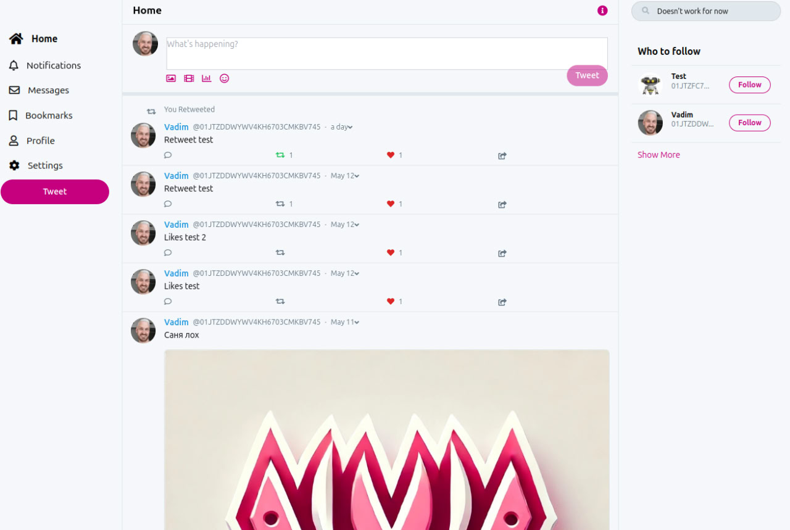

[](https://golang.org/dl/)
[](./LICENSE)
[](https://github.com/filinvadim/warpnet/actions/workflows/release.yaml)
[](https://t.me/warpnetdev)
<br />
<div align="center">
  <a href="https://github.com/myuser/myrepo">
    
  </a>

<h3 align="center">Warpnet</h3>

  <p align="center">
    An awesome README template to jumpstart your projects!
    <br />
    <a href="https://github.com/myuser/myrepo"><strong>Explore the docs »</strong></a>
    <br />
    <br />
    &middot;
    <a href="https://github.com/myuser/myrepo/issues/new?labels=bug&template=bug-report---.md">Report Bug</a>
    &middot;
    <a href="https://github.com/myuser/myrepo/issues/new?labels=enhancement&template=feature-request---.md">Request Feature</a>
  </p>
</div>

<details>
  <summary>Table of Contents</summary>
  <ol>
    <li>
      <a href="#about-the-project">About The Project</a>
      <ul>
        <li><a href="#built-with">Built With</a></li>
      </ul>
    </li>
    <li>
      <a href="#getting-started">Getting Started</a>
      <ul>
        <li><a href="#prerequisites">Prerequisites</a></li>
        <li><a href="#installation">Installation</a></li>
      </ul>
    </li>
    <li><a href="#usage">Usage</a></li>
    <li><a href="#roadmap">Roadmap</a></li>
    <li><a href="#contributing">Contributing</a></li>
    <li><a href="#license">License</a></li>
    <li><a href="#contact">Contact</a></li>
    <li><a href="#acknowledgments">Acknowledgments</a></li>
  </ol>
</details>



## General Principles of the Warp Network

1. WarpNet must operate independently of any third-party services.
2. WarpNet must not rely on any proprietary or third-party technologies.
3. A WarpNet node must be distributed as a single executable file.
4. WarpNet must be a cross-platform solution.
5. Only one WarpNet member node may run on a single machine, but it may have multiple aliases.
6. WarpNet member nodes must be governed solely by network consensus.
7. WarpNet business nodes may allow centralized management.
8. A WarpNet node must store private data only on the local host machine.
9. WarpNet member nodes must not be developed or controlled by a single individual.
10. Content on WarpNet must be moderated automatically, without human intervention.
11. Hosting a WarpNet bootstrap node must be incentivized with rewards.
12. Node owners bear full personal responsibility for any content they upload to WarpNet.

## Getting Started

This is an example of how you may give instructions on setting up your project locally.
To get a local copy up and running, follow these simple example steps.

### Prerequisites

This is an example of how to list things you need to use the software and how to install them.
* [Golang](https://go.dev/doc/install)

### How to run single node (dev mode)
- bootstrap node
```bash 
    go run cmd/node/bootstrap/main.go
```
- member node
```bash 
    go run cmd/node/member/main.go
```

### How to run multiple nodes (dev mode)
1. go to `config/config.go`:
   - change all ports to different ones;
   - change `database.dir` flag to different one.
2. Run every node as an independent OS process
   as described in the previous chapter.

* Example:
```bash 
    go run cmd/node/member/main.go --database.dir storage2 --node.port 4021 --server.port 4022
```

### How to run multiple nodes in isolated network (dev mode)
1. In addition to the previous chapter update flags:
    - change `node.network.prefix` flag to different one.
2. Run multiple nodes as described in the previous chapter.

* Example:
```bash 
    go run cmd/node/member/main.go --node.network.prefix myprefix
```

## Roadmap

- [x] TODO
- [x] TODO
- [ ] TODO
- [ ] TODO
- [ ] TODO
   - [ ] TODO
   - [ ] TODO

See the [open issues](TODO) for a full list of proposed features (and known issues).

## Contributing

Contributions are what make the open source community such an amazing place to learn, inspire, and create.
Any contributions you make are **greatly appreciated**.

If you have a suggestion that would make this better, please fork the repo and create a pull request. 
You can also open an issue with the tag "enhancement."
Remember to give the project a star! Thanks again!

1. Fork the Project
2. Create your Feature Branch (`git checkout -b feature/AmazingFeature`)
3. Commit your Changes (`git commit -m 'Add some AmazingFeature'`)
4. Push to the Branch (`git push origin feature/AmazingFeature`)
5. Open a Pull Request

### Top contributors:

<a href="https://github.com/todo/Best-README-Template/graphs/contributors">
  
</a>

## Contact

### Maintainer 
* Vadim Filin - github.com.mecdy@passmail.net

### Developers group in Telegram

* [warpnetdev](https://t.me/warpnetdev)

## License

Warpnet is free software licensed under the GNU General Public License v3.0 or later.

See the [LICENSE](./LICENSE) file for details.